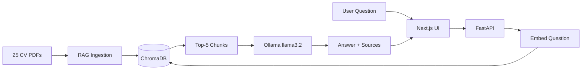

# AI-Powered CV Screener

> A full-stack prototype for screening CVs using a RAG pipeline. Ask natural language questions about a collection of candidates and get AI-powered answers with source attribution.

## Version: 0.1.2

## Tech Stack

| Layer | Technology |
|---|---|
| LLM & Embeddings | Ollama (local) · Gemini · OpenRouter |
| Vector Store | ChromaDB (local, embedded) |
| PDF Processing | pdfplumber |
| Backend | FastAPI + Python (uv) |
| Frontend | Next.js 15 + Tailwind CSS |

## Project Structure
ai-powered-cv-screener-repo/
├── backend/
│   ├── app/          # FastAPI app, core config, services
│   ├── scripts/      # CV generation + provider checker
│   └── data/         # CVs (PDF) + ChromaDB store
├── frontend/         # Next.js chat interface
└── docs/             # Architecture & workflow docs

## Prerequisites

- Python 3.10+ with uv
- Node.js 18+
- Ollama running locally (`ollama serve`)

## Quick Start

```bash
cd backend
uv pip install -e .
uv run check-providers   # verify your LLM provider is ready
```

## Changelog

### v0.3.2
- Auto-generated follow-up questions after each response (via LLM)
- Purple suggestion cards below assistant messages
- Click to instantly send as next question
- Fetched in parallel with main answer (no extra wait)

### v0.3.1
- Candidate browser: side drawer with all 25 candidates
- AI-generated avatars served as static files
- Click candidate → auto-asks for their profile summary
- Avatar fallback to initials placeholder
- remove-cvs now clears avatars folder too
- ingest-cvs cleans ChromaDB before reingest

### v0.3.0
- docs/diagram.md: full Mermaid architecture diagram
- README: embedded simplified diagram
- Provider options table with status

### v0.2.2
- /api/stats endpoint: chunks, CV count, provider, model
- Dynamic CV counter in UI (from backend)
- Provider + model shown in header
- Source attribution polished with percentage scores

### v0.2.1
- Custom exceptions: ProviderError, CollectionEmptyError
- Structured error responses from API (error code + detail)
- Frontend displays specific error messages per error type
- FastAPI Swagger UI available at /docs

### v0.2.0
- Full chat UI: Next.js 15, Tailwind, message bubbles, source badges
- Backend health indicator (green/red/yellow dot)
- Suggestion cards on empty state
- New conversation reset button
- End-to-end RAG pipeline working: CV → embed → search → LLM → UI

### v0.1.7
- FastAPI chat endpoint POST /api/chat
- RAG pipeline connected to LLM (Ollama/Gemini/OpenRouter)
- Source attribution in responses (candidate name + score)
- Clean candidate names in metadata
- CORS configured for frontend

### v0.1.6
- uv run configure: interactive CLI to switch LLM provider, image provider, and model
- OpenAI DALL-E 3 added as image provider option
- docs/providers.md updated with all provider setup guides

### v0.1.5
- AI photo generation via Cloudflare Workers AI (FLUX-1-schnell)
- Placeholder avatar fallback (initials, color-coded)
- IMAGE_PROVIDER config in .env: "cloudflare" | "placeholder"
- docs/providers.md: full setup guide for all providers

### v0.1.4
- RAG pipeline: PDF text extraction, chunking, embeddings via Ollama nomic-embed-text
- ChromaDB vector store with cosine similarity search
- ingest-cvs CLI command (uv run ingest-cvs)
- Semantic search returning top-K chunks with source attribution
- Robust JSON parsing for Llama response edge cases
- gitignore fix: excludes all CV output subfolders
- remove-cvs now accepts optional folder name (uv run remove-cvs [folder])

### v0.1.3
- CV generation script with Ollama (uv run generate-cvs --limit N)
- Timestamped output folders (data/cvs/YYYYMMDD-HHMM/)
- remove-cvs command to clean output folders
- CV PDF layout with ReportLab, data separated from logic

### v0.1.2
- check-providers CLI command (`uv run check-providers`)
- docs/cli-commands.md with usage reference

### v0.1.1
- LLM provider health checker (Ollama, Gemini, OpenRouter)

### v0.1.0
- Initial project scaffold

## Architecture



See [docs/diagram.md](docs/diagram.md) for the full detailed diagram.
