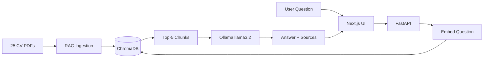

# AI-Powered CV Screener

> A full-stack prototype for screening CVs using a RAG (Retrieval-Augmented Generation) pipeline.
> Ask natural language questions about a collection of candidates and get AI-powered answers with source attribution.

## Version: 1.1.0

## Overview

This application allows recruiters to ask natural language questions about a collection of AI-generated CVs. It uses a RAG pipeline to retrieve relevant candidate information and generates answers via a local LLM — fully offline, fully free.



See [docs/diagram.md](docs/diagram.md) for the full detailed diagram.

## Tech Stack

| Layer | Technology |
|---|---|
| LLM & Embeddings | Ollama (local) · Gemini · OpenRouter |
| Vector Store | ChromaDB (local, embedded) |
| PDF Processing | pdfplumber |
| Backend | FastAPI + Python (uv) |
| Frontend | Next.js 15 + Tailwind CSS |
| Image Generation | Cloudflare Workers AI (FLUX) · OpenAI DALL-E 3 · Placeholder |

## Project Structure
ai-powered-cv-screener-repo/
├── backend/
│   ├── app/
│   │   ├── api/            # FastAPI endpoints (chat, settings, cvs)
│   │   ├── application/    # Use cases (ChatUseCase, IngestUseCase)
│   │   ├── core/           # Config, dependencies, exceptions
│   │   ├── domain/         # Entities and ports (hexagonal architecture)
│   │   └── infrastructure/ # Adapters (Ollama, ChromaDB, pdfplumber)
│   ├── scripts/            # CLI tools (generate, ingest, configure)
│   └── data/               # CVs (PDF) + ChromaDB + avatars
├── frontend/               # Next.js chat interface + settings
└── docs/                   # Architecture, diagrams, provider guides

## Prerequisites

- Python 3.10+ with [uv](https://github.com/astral-sh/uv)
- Node.js 18+
- [Ollama](https://ollama.com)

## Quick Start

### 1. Clone

```bash
git clone https://github.com/juannmcc/ai-powered-cv-screener-repo.git
cd ai-powered-cv-screener-repo
```

### 2. Install dependencies

```bash
# Backend
cd backend && uv pip install -e .

# Frontend
cd ../frontend && npm install
```

### 3. Setup Ollama

```bash
# Mac
brew install ollama

# Linux
curl -fsSL https://ollama.com/install.sh | sh

# Pull required models
ollama pull llama3.2
ollama pull nomic-embed-text
```

### 4. Configure

```bash
cd backend
cp .env.example .env
# Edit .env if needed — defaults work out of the box with Ollama
```

### 5. Start

Open 3 terminals:

```bash
# Terminal 1 — Ollama
ollama serve

# Terminal 2 — Backend
cd backend
uv run uvicorn app.main:app --host 0.0.0.0 --port 8000

# Terminal 3 — Frontend
cd frontend
npm run dev
```

Open [http://localhost:3000](http://localhost:3000)

### 6. Generate and ingest CVs

Once the app is running, go to **Settings → CV Management** to:
- Generate CVs (with or without AI photos)
- Ingest them into ChromaDB

Everything else is managed from the UI.

## Features

- **RAG Pipeline** — PDF extraction → chunking → embeddings → ChromaDB vector search
- **Multi-provider** — Ollama (local/free), Gemini, OpenRouter — switchable via Settings UI
- **AI Photos** — Cloudflare Workers AI (FLUX) or placeholder avatars
- **Chat UI** — Source attribution, follow-up suggestions, candidate browser with avatars
- **Settings Panel** — Provider config, API key management, CV generation/ingestion with streaming
- **Health monitoring** — Backend status, ingest status, auto-polling every 5s
- **Hexagonal Architecture** — Clean separation of domain, application, infrastructure layers

## Architecture

See [docs/architecture.md](docs/architecture.md), [docs/diagram.md](docs/diagram.md) and [docs/hexagonal.md](docs/hexagonal.md).

## Provider Setup

See [docs/providers.md](docs/providers.md) for detailed setup guides (Gemini, OpenRouter, Cloudflare).

## CLI Reference

All commands run from `backend/` via `uv run`. Most workflows are available in the UI.

| Command | Description |
|---|---|
| `uv run check-providers` | Validate all LLM/image providers |
| `uv run configure` | Interactive provider/model switcher |
| `uv run generate-cvs` | Generate CVs (`--limit N`, `--no-image`) |
| `uv run ingest-cvs` | Ingest PDFs into ChromaDB |
| `uv run remove-cvs` | Remove CV output folders |

See [docs/cli-commands.md](docs/cli-commands.md) for full reference.

## API

Swagger UI: [http://localhost:8000/docs](http://localhost:8000/docs)

## Changelog

### v1.1.0
- Hexagonal architecture: domain, application, infrastructure, interfaces layers
- Domain entities: Candidate, Chunk, ChatResponse, Source
- Domain ports: LLMPort, EmbeddingPort, VectorStorePort, PDFPort
- Infrastructure adapters: Ollama, Gemini, OpenRouter, ChromaDB, pdfplumber
- Application use cases: ChatUseCase, IngestUseCase
- Dependency injection via FastAPI Depends
- Legacy services layer removed
- docs/hexagonal.md: architecture documentation
- Backend offline UI state with copy-to-clipboard start command

### v1.0.0
- Complete full-stack RAG application
- Settings panel with provider management and CV management
- Real-time streaming for CV generation and ingestion
- Candidate browser with AI-generated avatars
- Auto-generated follow-up questions
- Ingest status monitoring with auto-polling

### v0.3.4
- Settings page /settings with LLM and image provider configuration
- API key management with real-time validation per provider
- CV Management panel: generate, ingest, delete with streaming logs
- Folder selector for ingestion with active folder indicator
- Cancel button for long-running operations

### v0.3.3
- Ingest status banner with link to Settings
- Real-time updates via SQLite direct reads
- Health, stats and candidates endpoints cache-free

### v0.3.2
- Auto-generated follow-up questions after each LLM response

### v0.3.1
- Candidate browser with AI avatars and side drawer

### v0.3.0
- Architecture diagram (Mermaid) in docs/

### v0.2.2
- Dynamic CV counter, stats endpoint, provider info in header

### v0.2.1
- Structured error handling backend + frontend

### v0.2.0
- Full chat UI: Next.js 15, health indicator, suggestions, reset button

### v0.1.7
- FastAPI chat endpoint with RAG + LLM + source attribution

### v0.1.6
- Interactive configure CLI

### v0.1.5
- AI photo generation (Cloudflare FLUX + placeholder fallback)

### v0.1.4
- RAG pipeline: PDF ingestion, embeddings, ChromaDB

### v0.1.3
- CV generation with timestamped folders, remove-cvs command

### v0.1.2
- check-providers CLI command

### v0.1.1
- LLM provider health checker

### v0.1.0
- Initial project scaffold
