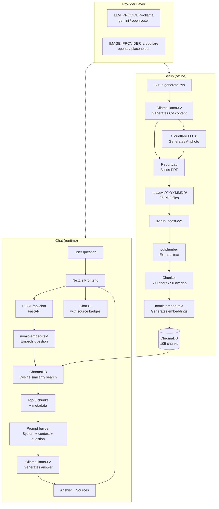

# System Architecture Diagram

## Complete Workflow

## Provider Options

| Layer | Provider | Cost | Status |
|---|---|---|---|
| LLM | Ollama (local) | Free | ✅ Active |
| LLM | Google Gemini | Free tier* | ⚠️ Region restricted |
| LLM | OpenRouter | Free tier / pay | ⚠️ Rate limited |
| Embeddings | nomic-embed-text (Ollama) | Free | ✅ Active |
| Image | Cloudflare Workers AI | Free (10k/day) | ✅ Active |
| Image | OpenAI DALL-E 3 | ~$0.04/image | 🔧 Configured |
| Image | Placeholder avatar | Free | ✅ Fallback |
| Vector DB | ChromaDB (local) | Free | ✅ Active |

*Spain and some EU regions blocked on free tier
